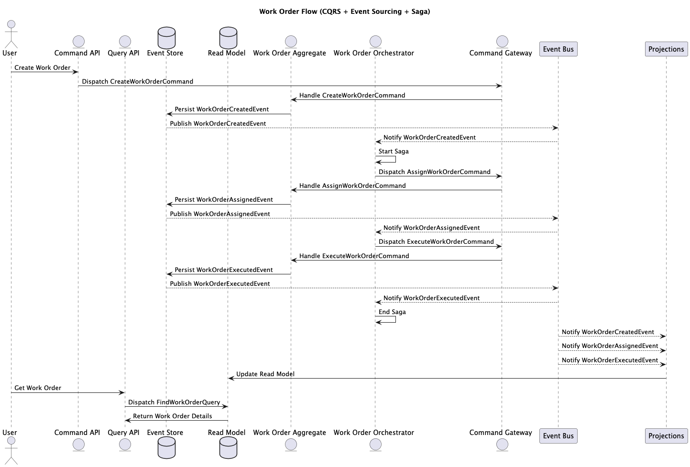

## Project Overview

Create a showcase project demonstrating the use of CQRS and event sourcing with Spring Boot and the Axon Framework. The project should focus on a "WorkOrder" aggregate, which can be created, assigned, and executed.

## Requirements

1. Technology Stack:
   - Spring Boot
   - Axon Framework
   - Java
   - REST API
   - Maven for build automation

2. Domain: WorkOrder
   -  A WorkOrder should have at least the following attributes:
     - *id*: Unique identifier
     - *instruction*: Description or instruction for the work order

3. CQRS Implementation:
   - Implement at least one command and one query.
   - Commands:
     - *CreateWorkOrderCommand*: To create a new work order.
     - *AssignWorkOrderCommand*: To assign a work order to a person.
     - *ExecuteWorkOrderCommand*: To execute a work order.
   - Queries:
     - *FindWorkOrderQuery*: To retrieve details of a work order by ID.

4. Event Sourcing:
   - Implement event sourcing to track changes to the WorkOrder aggregate.
   - Events:
       - *WorkOrderCreatedEvent*
       - *WorkOrderAssignedEvent*
       - *WorkOrderExecutedEvent*

5. REST API:
   - Expose the commands and queries via a REST API.
   - Endpoints:
     - POST */workorders* : Create a new work order.
     - PUT */workorders/{id}/assign* : Assign a work order to a person.
     - PUT */workorders/{id}/execute* : Execute a work order.
     - GET */workorders/{id}* : Retrieve a work order by ID.

6. Saga Pattern (Extra Credit):
   - Demonstrate understanding of the saga pattern by implementing a simple saga that coordinates the lifecycle of a WorkOrder.
   - Example: A saga that automatically assigns the work order to a person upon creation.

## Deliverables
- A fully functional Spring Boot application with the above features.
- Code should be well-documented and follow best practices.
- Share the project via a link to a public GitHub repository.

## Evaluation Criteria

- Correctness and completeness of the implementation.
- Code quality and adherence to best practices.
- Understanding and application of CQRS, event sourcing, and the saga pattern.
- Clarity and organization of the documentation.

---

## Questions / Suggestions
- REST API
  - Instead of /workorders we can use /work-orders since it is easier to read and no confusion with /workOrders.

## Running locally

### Prerequisites
- Java 21
- Maven

### Setup
1. Clone the repository:
   ```
   git clone git@github.com:mkhan-trustly/work-order-mngmnt.git
   ```
   
2. Navigate to the project directory:
   ```
   cd work-order-system
   ```
3. Build the project:
   ```
   mvn clean install
   ```
4. Run the application:
   ```
   mvn spring-boot:run
   ```

When application starts, configured to run on default port 8080
To use swagger, http://localhost:8080/swagger-ui/index.html

## Running tests
```
mvn clean test
```

## Sequence / Architecture diagram
Created using PlantUML, see [sequence-architecture.puml](sequence-architecture.puml)


## Architecture flow

### Command Side
1) The Command Gateway sends commands to the Command Bus.
2) The Command Bus routes commands to the appropriate Aggregate.
3) The Aggregate processes the command, applies events, and stores them in the Event Store.

### Event Side
1) The Event Store publishes events to the Event Bus.
2) The Event Bus distributes events to both Projections and Sagas.
3) Projections update the Read Model based on the events.

### Query Side
1) The Read Model is a query-optimized database used for read operations.
2) The Query API provides access to the Read Model for querying.

### Saga Side
1) Sagas listen to events from the Event Bus.
2) Based on the events, Sagas can send new commands to the Command Gateway to trigger further actions (e.g., compensating actions or follow-up commands).

## Design details

### Microservices
In the demo application we have created two main packages
- command
- query

In the real world, these will be two different microservices.

### Trade-off with consistency
- Axon leans toward AP (Availability and Partition Tolerance) by default, as it prioritizes processing events and commands even in the face of network partitions.

### Axon
Axon is responsible for handling CQRS and Event Sourcing, ensuring that commands and queries are separate.
It also helps manage event-driven communication between different parts of the system.

##### Aggregation
It represents a collection of related objects (like entities) that should be manipulated together.
This is helpful because in DDD, consistency and business logic are usually encapsulated within an Aggregate.

##### Transactional boundary
It also defines a boundary for transactions and state changes, meaning that you typically apply commands to an
Aggregate root, which then performs state changes or emits events.

#####  Event Store
A repository for events, which represent the changes that occurred in aggregates over time.

### Command Bus
The Command Bus is the infrastructure component responsible for routing commands to their respective command handlers. 
It is the backbone of the command dispatching mechanism. It ensures that commands are delivered to the correct aggregate or command handler.

### Command Gateway
The Command Gateway is a higher-level abstraction that simplifies the process of sending commands.
It provides a user-friendly interface (like send()) to interact with the Command Bus. 
When you call commandGateway.send(command), the Command Gateway delegates the command to the Command Bus for further processing.

##### Aggregate in Axon
* Is the entry point for changes to an entity’s state.
* Maintain invariants and rules for business logic.
* Emit events when changes happen, and these events are then stored in an Event Store.

#### Axon flow (in our application)

| Step                    | Axon component                     |  Operation |
|-------------------------|------------------------------------| -----------|
| Command received        | CommandGateway                     | Routes command to the correct aggregate.|
| Command processing      | @CommandHandler in Asset           | Applies an event. |
| Event emission          | apply(new A..Event())              | Axon publishes the event. |
| Event handling in Query | @EventHandler in AssetEventHandler | Updates the read model. |
| Query processing        | Query API in QueryController       | Returns data from the read model.

### Improvements
- Better state management for Work Order state transition.

---

### Advantages of Using CQRS, Event Sourcing, and Axon

##### Scalability
- CQRS: Read operations can be optimized separately from writes, allowing better query performance.
- Event Store: Since events are stored append-only, it enables efficient writes and horizontal scaling.

##### Strong Audit Trail & Compliance
- Event Sourcing: Maintains a full history of changes, making it easy to reconstruct past states.
- Axon: Provides automatic event replay and snapshots for better state recovery.

##### Improved Domain-Driven Design (DDD) implementation
- CQRS: Separates concerns between command (write) and query (read) models, making domain logic cleaner.
- Axon: Supports aggregates and sagas to manage business logic workflows.

##### Asynchronous processing & Event-Driven benefits
- Event Sourcing: Allows subscribers to react asynchronously to changes.
- Axon: Handles event dispatching, retries, and projections automatically.

#####  Easy integration with Microservices
- Event Store: Events can be consumed by other microservices without tight coupling.
- Axon: Provides built-in event distribution using Kafka, RabbitMQ, or Axon Server.s

### Disadvantages of Using CQRS, Event Sourcing, and Event Store with Axon

##### Increased complexity
- CQRS: Maintaining separate models for reads and writes adds development overhead.
- Event Sourcing: Requires additional logic to replay and transform events.
- Axon: Learning curve for handling aggregates, sagas, and distributed messaging.

##### Eventual consistency issues
- Since read and write models are separate, the system is not immediately consistent.
- Requires compensating mechanisms like snapshots and distributed transactions.

##### Storage overhead & Performance considerations
- Event Store: Growing event history increases storage requirements.
- Requires snapshots to improve event replay performance.

##### Debugging and querying complexity
- Debugging is harder because state is not stored as a snapshot but as an event sequence.
- Querying requires projections, which may need additional processing.

##### Potential vendor Lock-In
- Axon Server: While powerful, it may lock you into the Axon ecosystem.
- Alternative event stores (Kafka, PostgresSQL, etc.) might require custom integration.

### Trade-off with consistency
- In the context of CQRS, the write model (commands) and the read model (queries) are separated. This can lead to situations where the read model is slightly behind or inconsistent with the write model.
- For instance, after an event is written, the system might return an old version of the data until the read model is updated. This means the data is not immediately consistent between all services or components, which is a compromise on consistency.

#### How it impacts the system:
- Write Availability: The system remains available to handle write operations (e.g., creating or updating events), even if the read model or projections aren’t immediately updated.
- Read Availability: The system can serve queries even when they may not reflect the latest writes (since the read model may not be fully synchronized).
- Consistency: The system isn’t always in a consistent state at a given time. Instead, consistency is eventually achieved after the event store is processed and projections are updated.

## Sagas in Axon
#### Sagas (Story telling)
In a distributed system, you can’t use a single transaction because the steps span multiple services or components. 
Instead, Sagas break the process into smaller steps and handle failures by compensating for completed steps.
Work order management example:
```
Create a work order → assign it to an agent → execute the work order.
```
In simple terms, Sagas coordinate actions across multiple Aggregates in response to events.

#### Orchestration vs Choreography
- Orchestration: A central controller (Saga) explicitly coordinates the flow of events and commands.
- Choreography: Components react to each other's events without a central coordinator, leading to more decentralized communication.

#### Axon framework
Saga takes orchestration based approach.

- The Saga listens to domain events (@SagaEventHandler) and decides the next step.
- It tracks the state of a long-running process across multiple aggregates.
- It has a lifecycle (@StartSaga, @EndSaga) to manage business workflows.

Is Sagas a transaction? 
Sagas is not a transaction in the ACID sense, which also means that a Saga does not rollback previous actions if something fails. Instead a compensating action needs to be taken for example _FailedWorkOrderCommand_. 

### Unit test

#### Publishing vs Dispatching in Saga tests
- Publishing an event means simulating that an event has already happened in the system, i.e something already recorded in the event store. 
- Dispatching a command means sending a request to perform an action, i.e intention to modify the system state.
- Together it verifies that events trigger lead to correct command dispatching.

### FAQs
- Does Axon store the current state? No, this is not the way Event sourcing works. When an aggregate is loaded, Axon fetches all events related to that aggregate from the Event Store and then reapplied sequentially to reconstruct the latest state.
- What is a snapshot in Axon? To optimise replaying all events Axon supports snapshots, which store the latest known state of an aggregate at a specific point.
- Is it correct to say that projections (READ) are mutable? Yes, projections are mutable because they need to apply updates incrementally rather than replacing the entire dataset. Events only represent changes, not full state.
- Is it not a double job for READ (part) to also do the WRITE (store the projection)? Yes indeed but it offers better scalability, separation of concerns and optimized reads.
- Does Axon provide Retry mechanism on event lost? Axon introduced a Dead Letter Queue (DLQ) mechanism that allows events that fail repeatedly to be stored separately for later reprocessing.
- To fetch the historical data we need to eventually fetch it from the WRITE (part), does it mean that will also need to function as READ? Yes indeed, READ model is optimized for queries (fast, denormalized) and special functionality will require WRITE to also function as READ.

## Source
- Axon [docs](https://docs.axoniq.io/home/)
- AxonIQ [code examples](https://github.com/AxonIQ/code-samples)